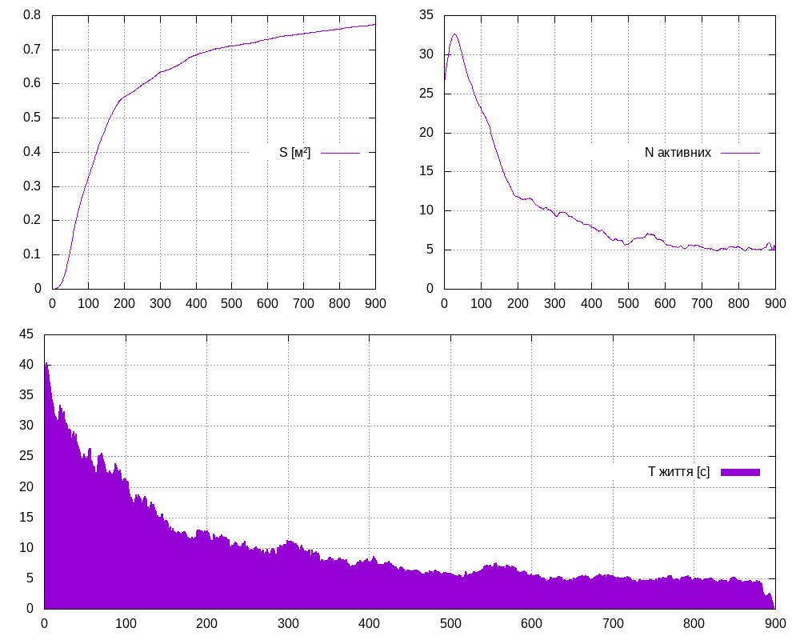

# #4. Coli Sphericus

This is our solution to the problem #4 of the Ukrainian olympiad of computer experiment 2022.

## Demo

Try it online [here](https://marklagodych.github.io/ColiSphericus).




## Build
```sh
cargo install wasm-pack
./build
```

## Run
Use a local server.

## Plot graphs
Install GNUPlot.

Use:
```sh
./plot A B C
```
to plot file `data/data-A.csv`.

`B` is either `0` or `1` and indicates if final size distribution is to be plotted.

`C` is either `0` or `1` and indicates if the script should generate an image of the graph only.
